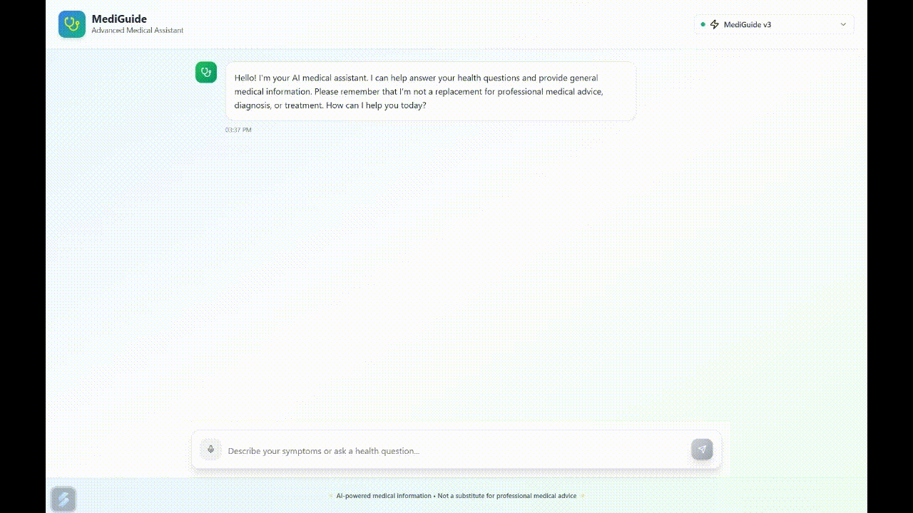

<div align="center">

<h1>
  
  MediGuide: Your AI Medical Assistant
</h1>

</div>


**MediGuide** is an intelligent medical chatbot powered by a fine-tuned **Mistral-7B-Instruct-v0.3** model. Trained on a custom medical dataset, it delivers trustworthy, context-aware, and conversational medical insights.





> ⚠️ **Disclaimer:** MediGuide is intended for informational and research purposes only. It is not a substitute for professional medical advice.

---

## Installation

```bash
# Clone the repository
git clone https://github.com/ankraj1234/MediGuide.git
cd mediGuide

# Install dependencies and start development server
npm install
npm run dev
```


# MediGuide: QLoRA vs Prompt Tuning

**MediGuide** is a research project that compares two parameter-efficient fine-tuning techniques — **QLoRA** and **Prompt Tuning** — applied to large language models for the task of medical instruction following. The goal is to evaluate the trade-offs between these methods in terms of performance, resource usage, and deployment efficiency.

---

## 1. Overview

We fine-tuned `mistralai/Mistral-7B-Instruct-v0.3` model with two different techniques : 

- QLoRA-based fine-tuning
- Prompt Tuning

Model was trained on medical instruction datasets, and evaluated on response quality, perplexity, latency, and rouge scores.

---

## 2. Fine-Tuning Strategies

### QLoRA-based fine tuning

- **Base Model**: `mistralai/Mistral-7B-Instruct-v0.3`
- **Fine-Tuning Method**: QLoRA (Quantized Low-Rank Adaptation)
- **Quantization**: 4-bit precision using NF4 with `BitsAndBytes`
- **LoRA Config**:
  - Rank: 64
  - Alpha: 16
  - Dropout: 0.1
  - Bias: none
- **Mixed Precision**: float16
- Paged AdamW Optimizer
- **Frameworks**: HuggingFace Transformers, Accelerate, PEFT, TRL

### Prompt-Tuned 

- **Base Model**: `mistralai/Mistral-7B-Instruct-v0.3`
- **Fine-Tuning Method**: Prompt Tuning via PEFT
- **Trainable Parameters**: 81,920 (0.0011% of total model parameters)
- **Features**:
  - 4-bit quantization (NF4)
  - Flash Attention
  - Gradient Checkpointing
  - Paged AdamW Optimizer
- **Mixed Precision**: Training done in 32-bit precision for prompt vectors

---

## 3. Datasets
- **Train**: [`sampled_6000`](https://github.com/ankraj1234/MediGuide/blob/master/sampled_6000.json)
- **Size**: ~6,000 examples
- **Test**: [`Mohammed-Altaf/medical-instruction-120k`](https://huggingface.co/datasets/Mohammed-Altaf/medical-instruction-120k)
- **Size**: ~1,000 examples
- **Processing**:
  - Extract instructions from `[|Human|]` to `[|AI|]`
  - Extract response from the last `[|AI|]` onward
- **Split**: Predefined train/dev/test

### Comparative Score Summary

| Metric                 | QLoRA              | Prompt Tuning               |
|------------------------|--------------------|-----------------------------|
| ROUGE-1                | 0.2398             | 0.2593                      |
| ROUGE-2                | 0.0307             | 0.0342                      |
| ROUGE-L                | 0.1212             | 0.1310                      |
| Perplexity             | 15.30              | 15.69                       |
| Average Token Loss     | 2.7282             | 2.00                        |
| Latency (128 tokens)   | ~7.2 sec           | ~7.4 sec                    |
| Fine-Tuned Size        | 161.2 MB           | 5.2 MB                      |
| Quantized Model Size   | ~1.9 GB            | ~4.14 GB                    |


